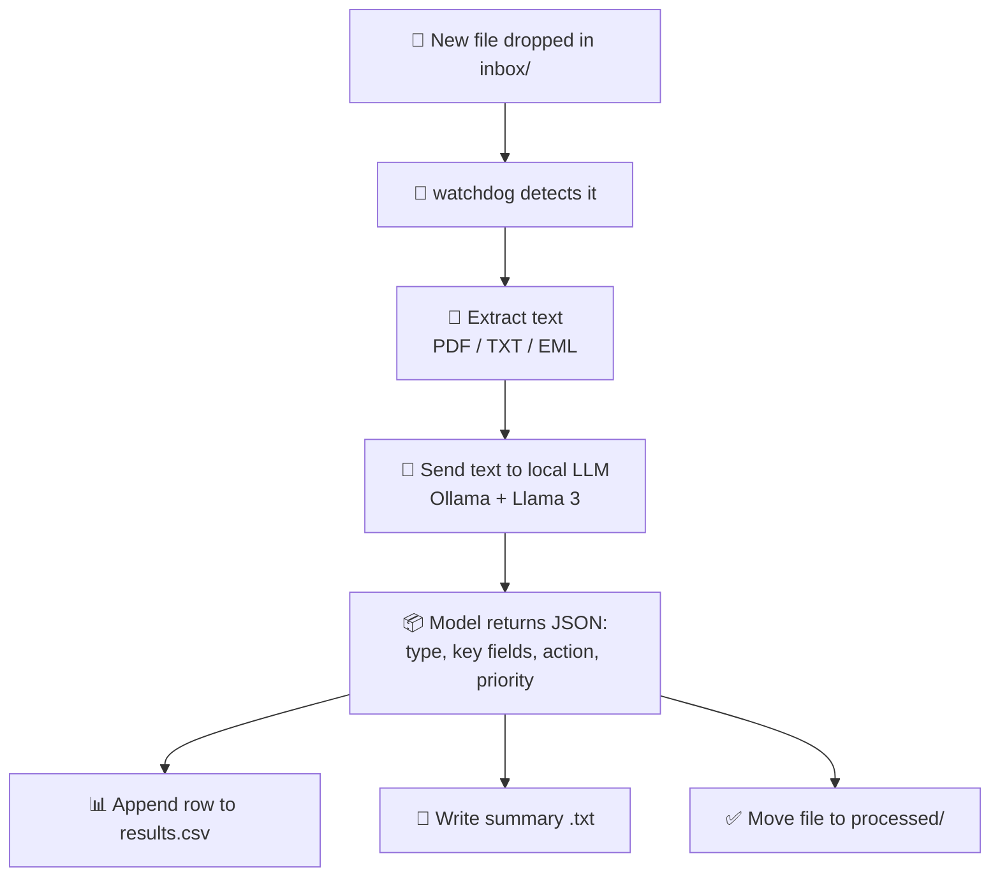

# 🤖 AI Document Assistant

An Agentic automation project that watches a folder, and whenever a new file lands in it, uses a local AI model to figure out what the document actually is and what should happen next.

No deterministic rules like `if "invoice" in filename`. The AI reads the content and decides.

---

## 🧠 How it works



The AI decision happens in one place: `ai_engine.py`. One prompt, one JSON response, no branching logic based on file type or name.

---

## 📁 Project structure

```
ai_doc_assistant/
├── main.py              # watches the folder, runs the pipeline
├── ai_engine.py         # talks to the LLM, parses its response
├── file_reader.py        # pulls text out of pdf / txt / eml files
├── output_writer.py     # writes results.csv and summary files
├── config.py             # paths and model settings
├── requirements.txt
├── inbox/                # 👉 drop files here
├── processed/            # files land here after being handled
└── outputs/
    ├── results.csv
    └── summaries/
```

---

## 🛠️ Setup (macOS)

**1. Install Ollama and pull a model**

```bash
brew install ollama
ollama pull llama3
```

**2. Make sure Ollama is running**

```bash
curl http://localhost:11434
```

If that doesn't respond, start it:

```bash
ollama serve
```

**3. Set up the Python environment**

```bash
cd ai_doc_assistant
python3 -m venv venv
source venv/bin/activate
pip install -r requirements.txt
```

**4. Run it**

```bash
python main.py
```

You should see:

```
[main] Watching folder: /path/to/ai_doc_assistant/inbox
[main] Using LLM provider: ollama
```

**5. Drop a file into `inbox/`**

Try a PDF invoice, a text note, or an `.eml` file. Within a few seconds:

```
[main] Processing: sample_invoice.pdf
[main] Done: sample_invoice.pdf -> classified as 'invoice'
```

**6. Check the results**

```bash
cat outputs/summaries/sample_invoice_summary.txt
open outputs/results.csv
```

---

## ✅ Example output

**`outputs/summaries/sample_invoice_summary.txt`**

```
File: sample_invoice.pdf
Type: invoice
Priority: medium

Summary:
Invoice from Brightline Office Supplies Ltd. for office supplies and services.

Suggested action:
Remit payment by e-transfer to accounts@brightlinesupplies.com, referencing invoice number INV-2026-0714.
```

**`outputs/results.csv`**

| filename | document_type | sender | amount | deadline | priority |
|---|---|---|---|---|---|
| sample_invoice.pdf | invoice | Brightline Office Supplies Ltd. | $915.87 | July 18, 2026 | medium |

---

## 🔁 Switching to OpenAI instead of Ollama

In `config.py`:

```python
LLM_PROVIDER = "openai"
```

Then, in your terminal:

```bash
export OPENAI_API_KEY="your-key-here"
```

---

## ⏸️ Stopping / restarting Ollama

**Stop it:**
```bash
ollama stop llama3
```
or quit the Ollama app from the menu bar if that's how you installed it.

**Start it again later:**
```bash
ollama serve
```

---

## 🚧 Current limitations

- 📄 Only reads text-based PDFs. Scanned or photographed invoices (no text layer) won't extract anything yet, OCR support is a planned next step.
- 📧 `.eml` support is basic, plain text emails only for now.


