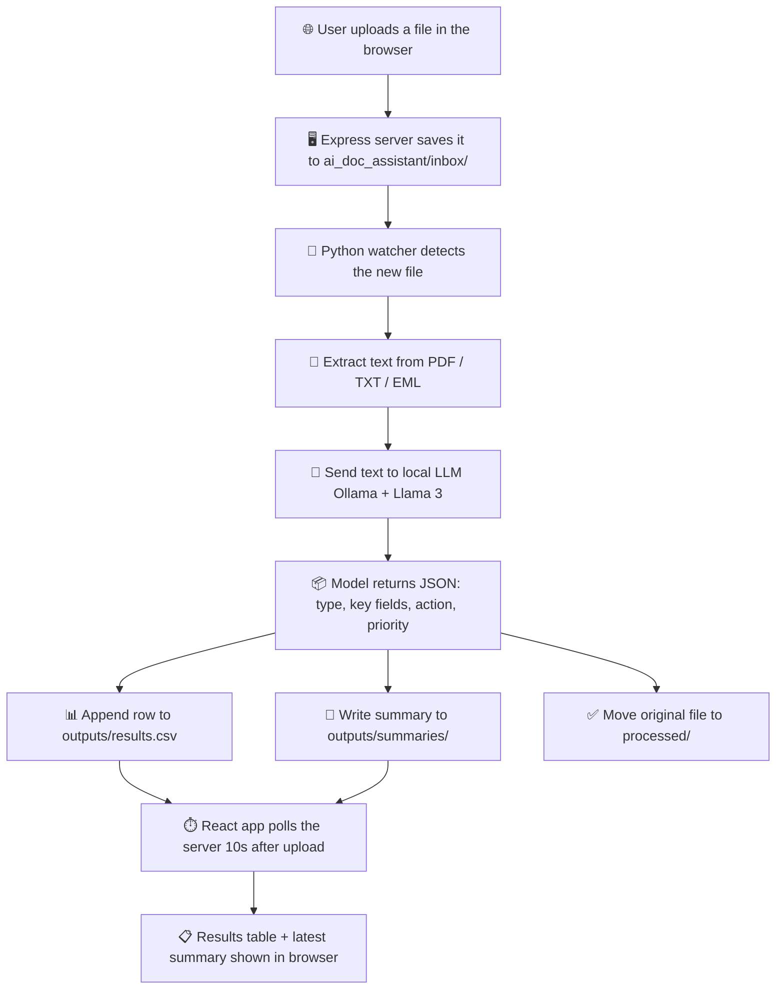

# 🤖 AI Document Assistant

An end-to-end document processing system. A React web app accepts a file upload, a Node.js server stores it, and a local AI pipeline reads the file, classifies it, and produces a structured summary — all without hardcoded rules like `if "invoice" in filename`. The AI reads the content and decides.

The result is displayed back in the browser: a results table and the latest AI-generated summary.

---

## 🧠 How it works



Three independent processes work together: the **frontend** (upload UI), the **server** (file storage and API), and the **AI engine** (classification pipeline). Each can be started and stopped on its own.

---

## 📁 Project structure

```
React/
├── frontend/                # React (Vite) upload UI
├── server/                  # Express API: handles uploads, serves results
└── ai_doc_assistant/
    ├── main.py               # watches inbox/, runs the pipeline
    ├── ai_engine.py          # talks to the LLM, parses its response
    ├── file_reader.py        # extracts text from pdf / txt / eml files
    ├── output_writer.py      # writes results.csv and summary files
    ├── config.py             # paths and model settings
    ├── inbox/                # server saves uploads here
    ├── processed/            # files land here after being handled
    └── outputs/
        ├── results.csv
        └── summaries/
```

---

## 🛠️ Setup

**Prerequisites:** Node.js, Python 3, and Ollama (or an OpenAI API key).

**1. Install Ollama and pull a model**

```bash
brew install ollama
ollama pull llama3
```

Confirm it is running:

```bash
curl http://localhost:11434
```

If it does not respond, start it with `ollama serve`.

**2. Set up the AI engine**

```bash
cd ai_doc_assistant
python3 -m venv venv
source venv/bin/activate
pip install -r requirements.txt
```

**3. Install server dependencies**

```bash
cd server
npm install
```

**4. Install frontend dependencies**

```bash
cd frontend
npm install
```

---

## ▶️ Running the project

Each component runs in its own terminal, in this order.

**1. Start the AI engine**

```bash
cd ai_doc_assistant
source venv/bin/activate
python main.py
```

**2. Start the server**

```bash
cd server
npm start
```

Runs at `http://localhost:4000`.

**3. Start the frontend**

```bash
cd frontend
npm run dev
```

Runs at `http://localhost:5173`. Open this URL in a browser.

**4. Upload a file**

Choose a file (PDF, TXT, or EML) and click Upload. The page shows "Processing..." for 10 seconds while the AI engine classifies the document, then displays the results table and the latest summary automatically.

---

## ✅ Example output

**`outputs/summaries/sample_invoice_summary.txt`**

```
File: sample_invoice.pdf
Type: invoice
Priority: medium

Summary:
Invoice from Brightline Office Supplies Ltd. for office supplies and services.

Suggested action:
Remit payment by e-transfer to accounts@brightlinesupplies.com, referencing invoice number INV-2026-0714.
```

**`outputs/results.csv`**

| filename | document_type | sender | amount | deadline | priority |
|---|---|---|---|---|---|
| sample_invoice.pdf | invoice | Brightline Office Supplies Ltd. | $915.87 | July 18, 2026 | medium |

---

## 🔁 Switching to OpenAI instead of Ollama

In `ai_doc_assistant/config.py`, set:

```python
LLM_PROVIDER = "openai"
```

Then export an API key before running `main.py`:

```bash
export OPENAI_API_KEY="your-key-here"
```

---

## 🚧 Current limitations

- Only reads text-based PDFs. Scanned or photographed documents (no text layer) will not extract any text; OCR support is a planned next step.
- `.eml` support is basic, plain text emails only for now.
- The 10-second processing delay in the UI is a fixed wait, not a check for whether the AI engine has actually finished.
